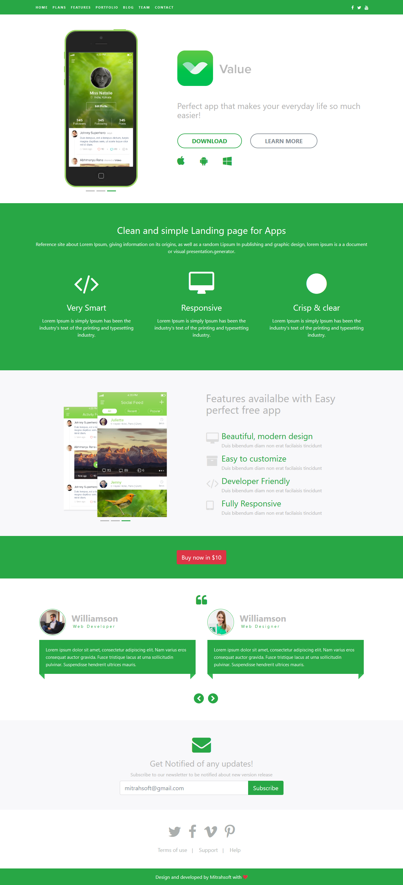

# **contentbox-theme-valueApp**

This is a free Content box Theme. You can use this theme for your website or use it as a reference for developing your own Content box theme. This theme shows how to properly use the contentstore & widgets with categories.



## Installation

> `**Need to be Updated**`

## How it works

We've created this theme based on the bootsnipp available in this link https://bootsnipp.com/snippets/35jBD. There are some custom widgets have been created for this theme & we should use this widgets to make the theme pretty similar to the original bootsnipp template.

 - **Widgets**
	- Slider for Header						:  A widget to show slider on home page.
	- Custom Media Manager 		:  A widget to give media manager path.
	- Custom Form Builder 				:  A widget that renders a form built in the FormBuilder Module.
	- Portfolio Items 						: A widget to show portfolio items on home page.
	- Team Members						: A widget to show team members on home page.
	- Features Items							: A widget to show feature items on home page.

``` This is still under development ```